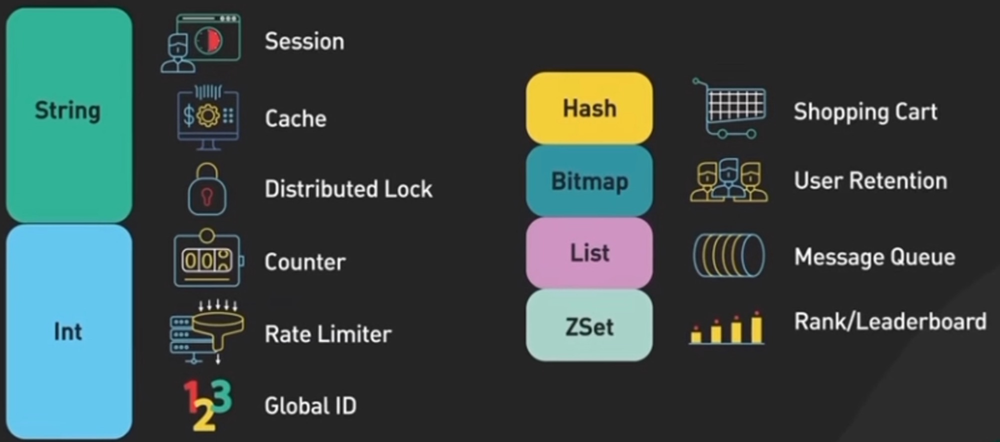
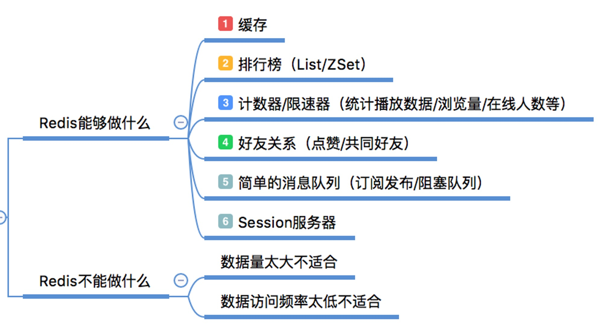

# What (定义)

Redis是一个使用ANSIC编写的支持网络、`基于内存`、分布式、可选持久性的`键值对存储数据库`。

# When (使用场景)

追求高性能高并发
- 高性能：针对复杂耗时久，sql变化不频繁的请求，适合将结果放入缓存，后续请求可直接缓存读取
- 高并发：大量请求都走数据库会导致数据库连接异常，需要redis做缓冲，先访问redis

## 适合场景举例：

### 1.缓存

<Image className="w-full" width={300} height={150} src="/static/images/redis/cache.jpg" alt="cache"/>
{/*  */}

### 2.会话存储（session）

<Image className="w-full" width={300} height={150} src="/static/images/redis/session.jpg" alt="session"/>
{/*  */}
当用户登录Web应用时候，将会话数据存储于Redis，并将唯一的会话ID（Session ID）返回到客户端的Cookie中。当用户再向应用发送请求时，会将此会话ID包含在请求中。无状态的Web服务器，根据这个会话ID从Redis中搜索相关的会话数据来进一步请求处理。

### 3.分布式锁（Distributed Lock）

<Image className="w-full" width={300} height={150} src="/static/images/redis/distributedBlock0.jpg" alt="distributedBlock0"/>
<Image className="w-full" width={300} height={150} src="/static/images/redis/distributedBlock1.jpg" alt="distributedBlock1"/>
{/* 
 */}
主要是用Redis的原子操作命令：`SETNX`，该命令仅允许key不存在的时候才能设置key

如上图所示。 Client 1通过`SETNX`命令尝试创建lock `1234abcd`。如果当前还没有这个key，那么将返回1。Client 1获得锁，就可以执行对共享资源的操作，操作完成之后，删除刚刚创建的lock（释放分布式锁）。如果Client 1在执行`SETNX`命令的时候，返回了0，说明有其他客户端占用了这key，那么等待一段时间（等其他节点释放）之后再尝试。

### 4.速率限制器（Rate Limiter）

    通过redis计数器功能，配合超时时间，来实现速率限制器，最常见的场景就是服务端是用的请求限流.

<Image className="w-full" width={300} height={150} src="/static/images/redis/rateLimit.jpg" alt="rateLimit"/>   
{/*  */}
    根据用户id或者ip来作为key，使用`INCR`命令来记录用户的请求数量。然后将该请求数量与允许的请求上限数量做比较，只有低于限制的时候，才会执行请求处理。如果超过限制，就拒绝请求。
    
    同时，请求数量的计数器需要设置一个时间窗口，比如：1分钟。也就是没过一分钟时间，计数器将被清零，重新计数。所以，当一个时间窗口中被限流之后，等到下一个时间窗口，就能恢复继续请求。以实现限制速率的效果。如下图：

    时间窗口算法：
<Image className="w-full" width={300} height={150} src="/static/images/redis/timeWindow.jpg" alt="timeWindow"/>
{/*  */}
    漏桶算法：
<Image className="w-full" width={300} height={150}  src="/static/images/redis/leakBucket.jpg" alt="leakBucket"/>
{/*  */}

### 5.排行榜（Rank/Leaderboard）

    通过排序集合（Sorted Sets）的功能实现各种排行榜功能
<Image className="w-full" width={300} height={150}  src="/static/images/redis/rank.jpg" alt="rank"/>
{/*  */}
    排序集合是唯一元素（比如：用户id）的集合，每个元素按分数排序，这样可以快速的按分数来检索元素
<Image className="w-full" width={300} height={150}  src="/static/images/redis/rank1.jpg" alt="rank1"/>
{/*  */}

# How (redis的各种场景是怎样实现的)

    - 更多[场景实际使用方法](https://cloud.tencent.com/developer/article/1867518)

    - [机制上的解释与控制](https://github.com/zlhcsm/javaOffer/blob/master/%E5%88%86%E5%B8%83%E5%BC%8F%E6%A1%86%E6%9E%B6/Redis%E4%B9%8B%E5%BA%94%E7%94%A8%E5%9C%BA%E6%99%AF%E8%AF%A6%E8%A7%A3.md)

# Why (为什么要用redis)

<Image className="w-full" width={300} height={150}  src="/static/images/redis/whyUse0.jpg" alt="whyUse0"/>
<Image className="w-full" width={300} height={150}  src="/static/images/redis/whyUse1.jpg" alt="whyUse1"/>
{/* 
 */}

# Redis导致的问题
1.缓存和数据库数据不一致，双写不一致

2.缓存雪崩

3.缓存穿透

4.缓存并发竞争的数据一致性

答案：[解决方案](https://github.com/zlhcsm/javaOffer/blob/master/%E5%88%86%E5%B8%83%E5%BC%8F%E6%A1%86%E6%9E%B6/Redis%E4%B9%8B%E5%BA%94%E7%94%A8%E5%9C%BA%E6%99%AF%E8%AF%A6%E8%A7%A3.md)

# Recap:

<Image className="w-full" width={300} height={150}  src="/static/images/redis/recap.jpg" alt="recap"/>
<Image className="w-full" width={300} height={150}  src="/static/images/redis/recap1.jpg" alt="recap1"/>
{/* 
 */}

# Quote:

  - https://www.didispace.com/youtube/20231003-redis-top-5-case.html#缓存-cache

  - https://juejin.cn/post/6844903641145425927
